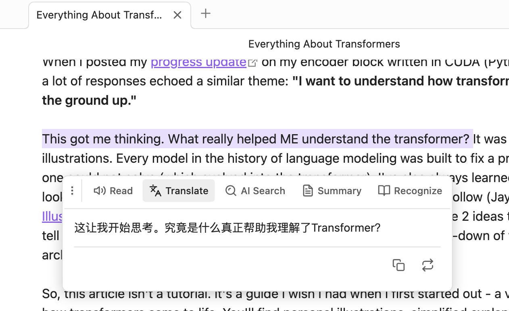

# Obsidian AI Selection Toolbar

[English](#english) | [中文](#中文)

---

## 中文

一个强大的 Obsidian 插件，为选中的文本提供悬浮 AI 工具栏，集成 AI 驱动的翻译、解释、总结和识词功能，同时支持浏览器内置和 API 双模式的文本朗读。

### 🚀 快速上手

1. **选中文本**：在编辑器中高亮选择需要处理的文本
2. **自动弹出菜单**：悬浮菜单会在选中后自动出现（300ms 防抖）
3. **点击功能按钮**：
   - 🔊 **朗读**：播放文本语音
   - 🌐 **翻译**：获取翻译结果
   - 💡 **AI 搜索**：获取智能解释
   - 📄 **总结**：提取文本要点
   - 📖 **识词**：查看单词音标和例句（仅限单词/短语）
4. **拖动菜单**：点击手柄图标可自由拖动菜单位置

### ✨ 核心功能

#### 🔊 智能朗读（TTS）
- **双模式支持**
  - 🌐 **浏览器内置 TTS**：无需 API，开箱即用
  - ☁️ **API 服务**：支持 OpenAI TTS 或兼容 API，音质更佳
- 选中文本一键朗读
- 支持语速和音调调节
- 播放/暂停控制
- 自动检测系统可用语音

#### 🌐 AI 翻译
- 流式输出翻译结果，实时查看
- 支持自定义目标语言
- 一键复制或替换原文
- 自定义提示词模板，适配不同翻译风格

#### 💡 AI 搜索（解释）
- 流式输出智能解释
- 快速理解概念、词汇或术语
- 支持自定义输出语言
- 可追加解释到笔记末尾

#### 📄 智能总结
- 流式输出总结内容
- 长文本快速提取要点
- 支持自定义输出语言
- 特色功能：
  - 🔄 刷新：重新生成总结
  - ⬇️ 插入：将总结插入到选中文本下方
  - 📋 复制：复制总结内容

#### 📖 识词（Word Recognition）
- **智能判断**：自动识别单词、短语或成语
  - 英文：支持单个单词或不超过 5 个单词的短语
  - 中文：支持词语或成语（不超过 10 个字）
  - 自动过滤句子（包含标点符号的长句）
- **功能展示**：
  - 📢 **发音按钮**：点击朗读单词/词组（使用浏览器 TTS）
  - 🔤 **音标显示**：IPA 音标（英文）或拼音（中文）
  - 📚 **例句展示**：AI 生成 2 个实用例句
- 适合语言学习和词汇积累

### ⚙️ 详细配置

#### 功能开关
所有功能都可以独立开启或关闭：
- ✅ 启用语音朗读
- ✅ 启用翻译
- ✅ 启用 AI 搜索
- ✅ 启用总结
- ✅ 启用识词

#### TTS 朗读设置

**提供商选择**
- 🌐 **浏览器内置**：免费、无需配置、离线可用
- ☁️ **API 服务**：需要配置 API，音质更好(开发中)

**浏览器 TTS 设置**（选择浏览器内置时）
- **语音选择**：自动检测系统可用语音
- **语速**：0.25 - 4.0（默认 1.0）
- **音调**：0.5 - 2.0（默认 1.0）

**API TTS 设置**（选择 API 服务时）
- **API URL**：TTS API 端点（支持 OpenAI 格式）
- **API Key**：你的 API 密钥（可选）
- **语音参数**：自定义参数，如 `voice=alloy&model=tts-1`
- **语速**：0.25 - 4.0

#### AI 设置
- **API URL**: AI API 端点（支持 OpenAI/Ollama 格式）
- **API Key**: 你的 API 密钥（本地模型可留空）
- **Model**: 模型名称（如 `gpt-3.5-turbo`、`gpt-4`）

#### 翻译设置
- **目标语言**: 选择或输入自定义语言（默认：English）
- **提示词模板**: 自定义翻译风格，使用 `{{targetLanguage}}` 占位符

#### 解释设置
- **输出语言**: 选择或输入自定义语言（默认：中文）
- **提示词模板**: 自定义解释风格，使用 `{{outputLanguage}}` 占位符

#### 总结设置
- **输出语言**: 选择或输入自定义语言（默认：中文）
- **提示词模板**: 自定义总结风格，使用 `{{outputLanguage}}` 占位符

#### 识词设置
- **提示词模板**: 自定义识词提示，使用 `{{word}}` 占位符
- 默认返回 JSON 格式：`{ "phonetic": "...", "examples": ["...", "..."] }`

### 📦 安装方法

#### 通过 Obsidian 社区插件（推荐）
1. 打开 Obsidian 设置
2. 进入「第三方插件」→「浏览」
3. 搜索 "AI Selection Toolbar"
4. 点击安装并启用

#### 手动安装
1. 从 [Releases](https://github.com/lxy3372/obsidian-ai-selection-toolbar/releases) 下载最新版本
2. 解压到 vault 的 `.obsidian/plugins/ai-selection-toolbar/` 目录
3. 重启 Obsidian
4. 在设置中启用插件

### 📝 API 兼容性

**支持的 TTS 提供商**（可选，浏览器模式无需配置）：
- OpenAI TTS API
- 其他兼容 OpenAI 格式的 TTS 服务

**支持的 AI 提供商**（必需）：
- ✅ OpenAI（GPT-3.5、GPT-4 等）
- ✅ Ollama（本地运行，免费）
- ✅ 其他兼容 OpenAI 格式的 API（如 Azure OpenAI、LiteLLM 等）

**推荐配置**：
- **零成本方案**：浏览器 TTS + Ollama 本地模型（如 `llama3`）
- **高质量方案**：OpenAI TTS + GPT-4

### 🐛 常见问题

<b>Q: 悬浮菜单不显示？</b>

- 确保在 Live Preview 或 Source 模式下（阅读模式不支持）
- 检查是否正确选中了文本
- 等待 300ms 防抖时间
- 检查插件是否已启用，至少开启一个功能

<b>Q: API 调用失败？</b>

- 检查 API URL 是否正确（格式：`https://api.openai.com/v1/chat/completions`）
- 验证 API Key 是否有效且有足够额度
- 打开开发者控制台（Ctrl/Cmd + Shift + I）查看详细错误信息
- 确保网络连接正常，能访问 API 服务器
- 如果使用 Ollama，确保本地服务已启动（`ollama serve`）

<b>Q: 浏览器 TTS 不发音？</b>

- 确认浏览器支持 Web Speech API（Chrome、Edge、Safari 支持）
- 检查系统音量是否开启
- 尝试选择不同的语音（部分语音可能不可用）
- 在设置中测试不同的语音选项

<b>Q: API TTS 音频无法播放？</b>

- 检查浏览器是否支持 Web Audio API
- 确认 TTS API 返回的是有效的音频数据（应为 MP3 格式）
- 查看控制台是否有解码错误
- 尝试使用浏览器 TTS 模式作为备选

<b>Q: 识词功能提示"不符合规则"？</b>

- 识词功能仅支持单词、短语或成语
- 英文：不超过 5 个单词，不包含句子标点（. ! ? ;）
- 中文：不超过 10 个字，不包含句子标点（，。！？；：等）
- 如果需要解释整句话，请使用「AI 搜索」功能

<b>Q: 如何使用本地 AI 模型（Ollama）？</b>

1. 安装 Ollama：https://ollama.ai/
2. 下载模型：`ollama pull llama3`
3. 启动服务：`ollama serve`
4. 插件设置：
   - AI API URL: `http://localhost:11434/v1/chat/completions`
   - API Key: 留空（本地模型无需）
   - Model: `llama3`（或其他已下载的模型）

<b>Q: 流式输出显示乱码？</b>

- 某些 API 提供商可能不完全兼容 OpenAI 流式格式
- 尝试更换 AI 模型或 API 提供商
- 检查 API URL 是否正确
- 查看控制台错误日志

### 🎯 使用场景

- 📖 **阅读学习**：快速翻译和理解外文文献
- ✍️ **写作辅助**：润色翻译、获取同义词解释
- 🌍 **语言学习**：识词功能查看音标和例句
- 📝 **笔记整理**：总结长文本、提取关键信息
- 🔊 **听力训练**：文本朗读，多语言发音练习

### 🛣️ 开发计划

- [ ] 支持更多 TTS 提供商
- [ ] 添加历史记录功能
- [ ] 支持批量处理
- [ ] 自定义快捷键
- [ ] 更多语言的 UI 本地化

### 📄 许可证

MIT License - 详见 [LICENSE](LICENSE) 文件

### 💖 支持项目

如果这个插件对你有帮助，欢迎：
- ⭐ 给项目点个 Star
- 🐛 报告 Bug 和建议
- 📢 分享给其他 Obsidian 用户

### 📮 反馈与建议

- 💬 [GitHub Issues](https://github.com/lxy3372/obsidian-ai-selection-toolbar/issues)
- 🌐 [GitHub Discussions](https://github.com/lxy3372/obsidian-ai-selection-toolbar/discussions)

---

## English

A powerful Obsidian plugin that provides a floating AI toolbar for selected text, featuring AI-powered translation, explanation, summarization, and word recognition, with dual-mode text-to-speech support (browser-based and API-based).

### 🚀 Quick Start

1. **Select Text**: Highlight the text you want to process in the editor
2. **Auto-popup Menu**: The floating menu appears automatically after selection (300ms debounce)
3. **Click Function Buttons**:
   - 🔊 **Read**: Play text-to-speech
   - 🌐 **Translate**: Get translation result
   - 💡 **AI Search**: Get intelligent explanation
   - 📄 **Summary**: Extract key points
   - 📖 **Recognize**: View word phonetics and examples (words/phrases only)
4. **Drag Menu**: Click and drag the handle icon to reposition the menu

### ✨ Key Features

#### 🔊 Smart Text-to-Speech
- **Dual Mode Support**
  - 🌐 **Browser Built-in TTS**: No API required, works out of the box
  - ☁️ **API Service**: Supports OpenAI TTS or compatible APIs for better quality
- One-click text reading
- Adjustable speed and pitch
- Play/Pause control
- Auto-detect available system voices

#### 🌐 AI Translation
- Streaming translation output with real-time display
- Customizable target language
- One-click copy or replace original text
- Custom prompt templates for different translation styles

#### 💡 AI Search (Explanation)
- Streaming intelligent explanations
- Quick understanding of concepts, terms, or vocabulary
- Customizable output language
- Append explanations to note

#### 📄 Smart Summarization
- Streaming summary output
- Quick extraction of key points from long texts
- Customizable output language
- Special features:
  - 🔄 Refresh: Regenerate summary
  - ⬇️ Insert: Insert summary below selected text
  - 📋 Copy: Copy summary content

#### 📖 Word Recognition
- **Smart Detection**: Automatically identifies words, phrases, or idioms
  - English: Single words or phrases up to 5 words
  - Chinese: Words or idioms (up to 10 characters)
  - Auto-filter sentences (long texts with punctuation)
- **Features**:
  - 📢 **Pronunciation Button**: Click to read word/phrase (using browser TTS)
  - 🔤 **Phonetic Display**: IPA notation (English) or Pinyin (Chinese)
  - 📚 **Example Sentences**: AI-generated 2 practical examples
- Perfect for language learning and vocabulary building

### ⚙️ Configuration

#### Feature Toggles
All features can be independently enabled or disabled:
- ✅ Enable Text-to-Speech
- ✅ Enable Translation
- ✅ Enable AI Search
- ✅ Enable Summary
- ✅ Enable Word Recognition

#### TTS Settings

**Provider Selection**
- 🌐 **Browser Built-in**: Free, no configuration, works offline
- ☁️ **API Service**: Requires API configuration, better quality

**Browser TTS Settings** (When browser built-in is selected)
- **Voice Selection**: Auto-detect available system voices
- **Speed**: 0.25 - 4.0 (default 1.0)
- **Pitch**: 0.5 - 2.0 (default 1.0)

**API TTS Settings** (When API service is selected)
- **API URL**: TTS API endpoint (OpenAI format supported)
- **API Key**: Your API key (optional)
- **Voice Parameters**: Custom parameters, e.g., `voice=alloy&model=tts-1`
- **Speed**: 0.25 - 4.0

#### AI Settings
- **API URL**: AI API endpoint (OpenAI/Ollama format supported)
- **API Key**: Your API key (leave empty for local models)
- **Model**: Model name (e.g., `gpt-3.5-turbo`, `gpt-4`)

#### Translation Settings
- **Target Language**: Select or enter custom language (default: English)
- **Prompt Template**: Customize translation style using `{{targetLanguage}}` placeholder

#### Explanation Settings
- **Output Language**: Select or enter custom language (default: Chinese)
- **Prompt Template**: Customize explanation style using `{{outputLanguage}}` placeholder

#### Summary Settings
- **Output Language**: Select or enter custom language (default: Chinese)
- **Prompt Template**: Customize summary style using `{{outputLanguage}}` placeholder

#### Word Recognition Settings
- **Prompt Template**: Customize word recognition prompt using `{{word}}` placeholder
- Default returns JSON format: `{ "phonetic": "...", "examples": ["...", "..."] }`

### 📦 Installation

#### Via Obsidian Community Plugins (Recommended)
1. Open Obsidian Settings
2. Go to "Community Plugins" → "Browse"
3. Search for "AI Selection Toolbar"
4. Click Install and Enable

#### Manual Installation
1. Download the latest release from [Releases](https://github.com/lxy3372/obsidian-ai-selection-toolbar/releases)
2. Extract to `.obsidian/plugins/ai-selection-toolbar/` in your vault
3. Restart Obsidian
4. Enable the plugin in Settings

### 📝 API Compatibility

**Supported TTS Providers** (Optional, not needed for browser mode):
- OpenAI TTS API
- Other OpenAI-compatible TTS services

**Supported AI Providers** (Required):
- ✅ OpenAI (GPT-3.5, GPT-4, etc.)
- ✅ Ollama (local deployment, free)
- ✅ Other OpenAI-compatible APIs (e.g., Azure OpenAI, LiteLLM)

**Recommended Configurations**:
- **Zero-cost**: Browser TTS + Ollama local models (e.g., `llama3`)
- **High-quality**: OpenAI TTS + GPT-4

### 🐛 FAQ

<b>Q: Floating menu not showing?</b>

- Ensure you're in Live Preview or Source mode (Reading mode not supported)
- Check if text is properly selected
- Wait for 300ms debounce time
- Check if plugin is enabled and at least one feature is turned on

<b>Q: API call failed?</b>

- Verify API URL is correct (format: `https://api.openai.com/v1/chat/completions`)
- Ensure API Key is valid and has sufficient quota
- Open developer console (Ctrl/Cmd + Shift + I) to view detailed error messages
- Check network connection and API server accessibility
- If using Ollama, ensure local service is running (`ollama serve`)

<b>Q: Browser TTS not speaking?</b>

- Confirm browser supports Web Speech API (Chrome, Edge, Safari supported)
- Check system volume is on
- Try selecting different voices (some voices may be unavailable)
- Test different voice options in settings

<b>Q: API TTS audio not playing?</b>

- Check if browser supports Web Audio API
- Confirm TTS API returns valid audio data (should be MP3 format)
- Check console for decoding errors
- Try using browser TTS mode as an alternative

<b>Q: Word recognition says "not eligible"?</b>

- Word recognition only supports words, phrases, or idioms
- English: Up to 5 words, no sentence punctuation (. ! ? ;)
- Chinese: Up to 10 characters, no sentence punctuation (，。！？；：etc.)
- For full sentences, use "AI Search" feature instead

<b>Q: How to use local AI models (Ollama)?</b>

1. Install Ollama: https://ollama.ai/
2. Download model: `ollama pull llama3`
3. Start service: `ollama serve`
4. Plugin settings:
   - AI API URL: `http://localhost:11434/v1/chat/completions`
   - API Key: Leave empty (not needed for local models)
   - Model: `llama3` (or other downloaded models)

<b>Q: Streaming output showing garbled text?</b>

- Some API providers may not be fully compatible with OpenAI streaming format
- Try switching AI model or API provider
- Check if API URL is correct
- Review console error logs

### 🎯 Use Cases

- 📖 **Reading & Learning**: Quickly translate and understand foreign literature
- ✍️ **Writing Assistance**: Polish translations, get synonym explanations
- 🌍 **Language Learning**: Word recognition for phonetics and examples
- 📝 **Note Organization**: Summarize long texts, extract key information
- 🔊 **Listening Practice**: Text reading for multi-language pronunciation practice

### 🛣️ Roadmap

- [ ] Support for more TTS providers
- [ ] Add history feature
- [ ] Support batch processing
- [ ] Custom keyboard shortcuts
- [ ] More UI localizations

### 📄 License

MIT License - See [LICENSE](LICENSE) file for details

### 💖 Support the Project

If this plugin helps you:
- ⭐ Star the project
- 🐛 Report bugs and suggestions
- 📢 Share with other Obsidian users

### 📮 Feedback

- 💬 [GitHub Issues](https://github.com/lxy3372/obsidian-ai-selection-toolbar/issues)
- 🌐 [GitHub Discussions](https://github.com/lxy3372/obsidian-ai-selection-toolbar/discussions)
